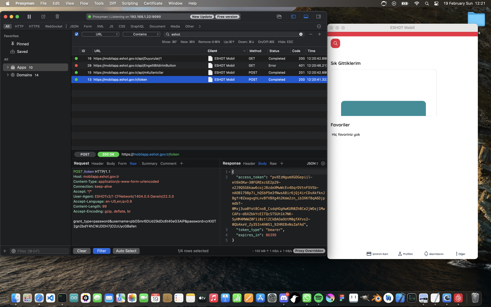
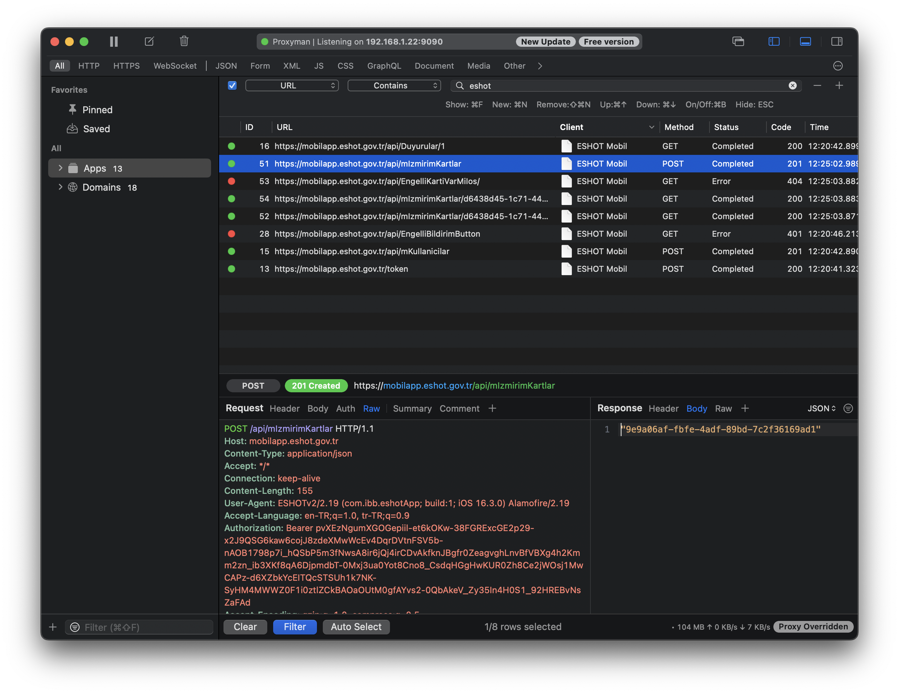
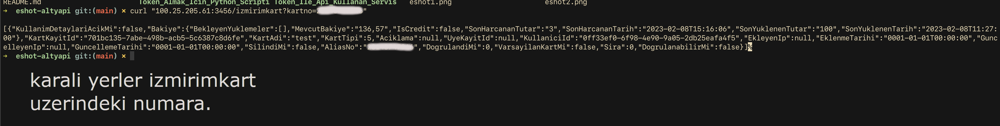

Yalnızca AçıkVeri ile yaptığım mobil uygulama için -> https://github.com/efe3535/eshot-react-native

# Hos geldiniz

Burada eshot altyapisini kullanabilmek icin gerekenleri paylastim, boylece bunun nasil oldugunu gorebileceksiniz. Ek olarak birkac resim ekledim, PNG uzantililar. Onlari da inceleyebilirsiniz.

## iletisim
`a.efe.akyazi@gmail.com`
`a.efe.akyazi@protonmail.com`

İyi calismalar dilerim :-)
